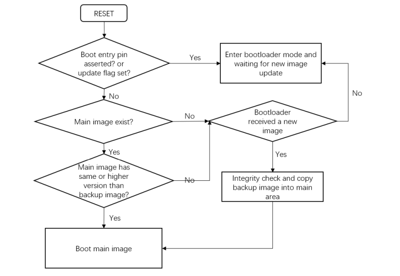
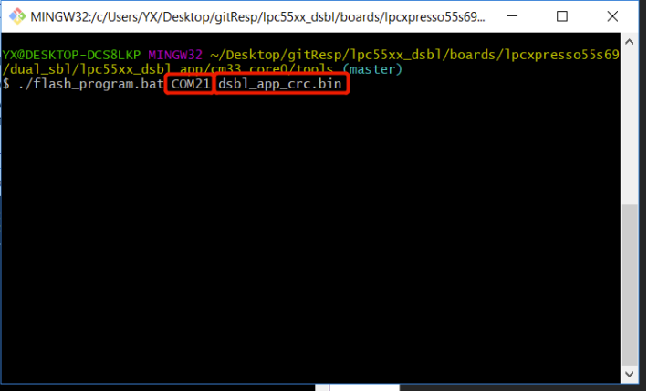

# NXP Application Code Hub
[](https://www.nxp.com)

## AN13497: Firmware Update Using Secondary Bootloader
Dual image update (reliable update) is an important feature for advanced bootloaders. It assures that at least one image is bootable and works properly at any time. It prevents image lost during the image update period. The mechanism behind the dual image boot loader is simple. If any accident happens, it always makes a copy of previous image. The bootloader detects and uses previous image as the bootable image. 

However, the ROM bootloader of LPC55xx does not support dual image feature yet. So, this application note implements a simple dual image update example on LPC55xx. It is useful to users who must implement a second dual image bootloader on LPC55xx series

Please refer to AN13497 for complete instructions on how to use this software.
https://www.nxp.com/docs/en/application-note/AN13497.pdf

#### Boards: LPCXpresso55S36
#### Categories: Industrial
#### Peripherals: UART, GPIO, FLASH
#### Toolchains: MDK

## Table of Contents
1. [Software](#step1)
2. [Hardware](#step2)
3. [Setup](#step3)
4. [Results](#step4)
5. [FAQs](#step5) 
6. [Support](#step6)
7. [Release Notes](#step7)

## 1. Software<a name="step1"></a>

### Overview

To ensure a reliable update, implement a dual image layout. Download the image to a temporary region called receive region. In every power cycle, the bootloader checks (integrity check passed) the image in receive region. If the downloaded new image has higher version number than the current image, DSBL copies the image from receive region to the main region. To track the latest version in both regions, locate a version flag in the image.

In summary: 

*  Receive region: 
  *  Bootloader always downloads new code to this area. 
* Main region: 
  * To store a correct image copied from the receive region. 
  *  DSBL finally jumps to the main image (if exists) to run the application code

The communication interface in this application note is via UART for demo purpose. Users can easily extend communication interface to others, such as, I2C SPI. The communication protocol follows NXP MCUBOOT protocol. It is compatible with LP55xx ROM. Following MCUBOOT protocol is helpful for users to reuse PC blhost software.


### Boot flow

The DSBL is used to manage images and boot application. Every time when the part is powered on or reset, the DSBL code is executed. below figure shows the DSBL boot flow.



### Software information
- SDK: 2.10.0
- CM33: MDK V5.38

## Hardware<a name="step2"></a>

- Micro USB Cable
- LPCXpresso55S36 Rev A
- Personal Computer

The hardware uses LPC55S36 EVK board, as shown in Figure 6. Make sure you have read board user guide and familiar with basic function of the board, such as the positions of the Reset button and the debug connector, and so on. This demo uses Debug and UART USB connector (1) as the debug interface and UART


USB bridge and WAKEUP button (7) is used as the entry pin of the second bootloader. 

The hardware uses LPCXpresso55S36 board, as shown in Figure 7. Make sure you have read board user guide and familiar with basic function of the board, such as the positions of the RESET button and the debug connector, etc. This demo uses Debug and UART USB connector (J1) as the debug interface and UART-USB bridge. Also, WAKEUP button (SW1) is used as the entry pin of the second bootloader.

## 3. Setup<a name="step3"></a>

> Note: Ensure that you have basic knowledge about the LPC5500 series EVK board, have installed related LPC-Link II debugger driver, have successfully run the hello_world example in the SDK folder, and have verified the UART communication with PC.

1. Connect USB with Debug and UART USB connector (1) to power up board and establish debug and UART connection. 
2. Open, compile, and download the lpc55xx_dsbl project. Open your serial terminal with 115200-N-8-N-1.
3.  Hold Wake-up button (7), and then press the RESET button. This forces DSBL to enter boot loader mode. In this mode, DSBL does not boot any application, but waits for UART connection. 
4. By default, the lpc55xx_dsbl enables debug log. The terminal provides information on Figure 2, which indicates that the DSBL is successful running and enters the boot loader mode. 
5. Open and compile project: lpc55xx_dsbl_app. Do not use IDE to download the lpc55xx_dsbl_app project. Otherwise, it is meaningless to demonstrate the boot loader feature.

```
CoreClock:96Mhz
enter lpc5500 dual bootloader demo...
```

6. Open the \boards\\dual_sbl\lpc55xx_dsbl_app\cm33_core0\tools folder and double click post_build.bat. This generates dsbl_app_crc.bin , which adds CRC and image length information to image_generator.exe. The dsbl_app_crc.bin is the binary image to be downloaded in the Receive region.
7.  Close the serial terminal. Open bash window or command window and execute flash_program.bat. This script calls blhost.exe and downloads dsbl_app_crc.bin in the Receive region. Running flash_program.bat need two parameters: UART COM index and the full name of the app image.
8. As the script executes, the new image is downloaded in the Receive region



9. Reopen UART terminal and press the RESET button


## 4. Results<a name="step4"></a>

The log image found: 0x0004_0000 indicates that DSBL has detected there is an image resided in Receive region.
Since the main region does not have any valid image, the DSBL copes receives image in the main region and boots it.


The log hello, main image running, Version: 7 indicates that the main image has already run.

## 5. FAQs<a name="step5"></a>

## 6. Support<a name="step6"></a>
#### Project Metadata
<!----- Boards ----->
[](https://github.com/search?q=org%3Anxp-appcodehub+LPCXpresso55S36+in%3Areadme&type=Repositories)

<!----- Categories ----->
[](https://github.com/search?q=org%3Anxp-appcodehub+industrial+in%3Areadme&type=Repositories)

<!----- Peripherals ----->
[](https://github.com/search?q=org%3Anxp-appcodehub+uart+in%3Areadme&type=Repositories) [](https://github.com/search?q=org%3Anxp-appcodehub+gpio+in%3Areadme&type=Repositories) [](https://github.com/search?q=org%3Anxp-appcodehub+flash+in%3Areadme&type=Repositories)

<!----- Toolchains ----->
[](https://github.com/search?q=org%3Anxp-appcodehub+mdk+in%3Areadme&type=Repositories)

Questions regarding the content/correctness of this example can be entered as Issues within this GitHub repository.

>**Warning**: For more general technical questions regarding NXP Microcontrollers and the difference in expected funcionality, enter your questions on the [NXP Community Forum](https://community.nxp.com/)

[](https://www.youtube.com/@NXP_Semiconductors)
[](https://www.linkedin.com/company/nxp-semiconductors)
[](https://www.facebook.com/nxpsemi/)
[](https://twitter.com/NXP)

## 7. Release Notes<a name="step7"></a>
| Version | Description / Update                           | Date                        |
|:-------:|------------------------------------------------|----------------------------:|
| 1.0     | Initial release on Application Code HUb        | June 7<sup>th</sup> 2023 |

